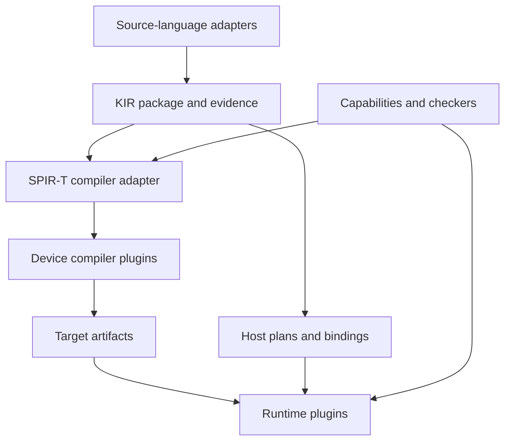

# 01. Target architecture

## 1. Separate the four extension axes

1. **Frontend:** understand a source language, discharge or record its verification obligations, and export KIR.
2. **Device compiler:** transform KIR kernel bodies through SPIR-T and lower them to a supported device format.
3. **Device runtime:** allocate resources, load artifacts, submit work, enforce ordering, and report completion/errors.
4. **Host binding:** expose compiled packages and host plans to an application language.

A fifth package type carries **semantic extensions**: operation definitions, capability schemas, reference semantics, checkers, and lowering rules. It does not gain permission to call an unsupported operation safe.

This is a dependency diagram. The host execution plan retains CPU control flow and resource operations; it is not converted into a GPU shader.

## 2. Proposed module ownership

| Component | Owns | May depend on | Must not depend on |
|---|---|---|---|
| `contracts/` | Versioned KIR, artifact, runtime protocol, diagnostics, extension envelope | Serialization specifications | F* AST, Rust object layout, CUDA/Vulkan headers |
| `semantics/` | Operation meanings, memory/effect model, profile obligations | Contracts and proof foundations | Vendor dispatch logic |
| `core/` | Package validation, planning, discovery, deterministic selection, cache policy | Contracts and protocol clients | Concrete GPU SDKs or frontend implementation types |
| `adapters/fstar/` | F*/Pulse extraction and source evidence | Pinned F* internals, contracts | Runtime implementation, Vulkan/CUDA source generation |
| `compiler/spirt/` | KIR ↔ SPIR-T mapping and approved transformation pipelines | Pinned SPIR-T, contracts | Application language runtime |
| Backend package | Code generation, driver adapter, target profile, qualification data | Public contracts; private vendor tooling | Core source patches or other backend internals |
| Host binding package | Idiomatic application API, ownership wrapper, marshaling | Stable runtime protocol/ABI | SPIR-T Rust structs, F* compiler |
| `validation/` | Independent interpreters/checkers, workload tests, evidence inspection | Public contracts | Hidden knowledge of a particular registered backend |

These paths describe responsibilities. P1 decides exact crate/build boundaries. Independently distributed plugins must not require inclusion in the main repository's Cargo workspace or edits to its lockfile. Their lockfiles and native dependencies belong to their own packages.

Prefer safe Rust for the new core, contract tools, and SPIR-T adapter. Keep necessary native driver FFI in small auditable runtime adapters or helper processes. This is a containment policy, not a claim that all driver interactions can be implemented without unsafe code. Retain the existing F* implementation of the frontend adapter initially.

## 3. Three artifacts with different purposes

**Portable KIR package:** canonical kernel/host semantics, resource layouts, symbols, requirements, source mappings, proof/evidence references, and dependency digests. This is the stable extraction boundary.

**Compiler working representation:** process-local SPIR-T objects and analysis state. Pin their version inside the compiler package. Their pretty-printed form is a diagnostic artifact; it is not the persistence or interchange format.

**Target package:** device code or backend-specific IR, exact target environment, host ABI layout, entrypoint reflection, specialization values, numerical policy, proof/checker results, and compilation provenance. A target package is loadable only by compatible runtime packages.

Never cache a raw pointer, process-local entity ID, driver handle, or native Rust struct as a portable artifact.

## 4. Preserve information deliberately

The frontend must export facts before erasure loses them: element types, layout relations, alignment, aliasing permissions, subgroup assumptions, matrix dimensions, uniformity, effects, and numeric modes. Keep ghost derivations in evidence/side metadata, bound to executable operations by stable IDs and digests. Debug information is separately classified; dropping debug information must not drop a semantic requirement.

Do not preserve every compiler AST node forever. Preserve the information required to check semantics or guide a justified optimization. Each transformation declares facts it consumes, preserves, establishes, or invalidates. After a rewrite, stale evidence is rejected or regenerated.

An opaque extension cannot be treated as pure by default. Until a trusted/checkable operation definition is available, it is an optimization barrier and cannot enter a verified executable profile.

## 5. Compiler control without backend coupling

Provide a deterministic pipeline planner. Pass packages declare input/output dialect versions, preconditions, effects, analysis invalidation, target requirements, and evidence obligations. The planner builds an explicit acyclic pass graph and rejects ambiguous or cyclic lowering plans.

Users can inspect the selected plan, choose approved passes, disable an optimization, pin specialization choices, inspect each IR stage, and compare costs. Performance tuning may suggest candidate schedules; acceptance is controlled by semantic checks and measured budgets. The trusted path does not depend on a tuning model being correct.

Separate mandatory legalization from optional optimization. Disabling an optimization must not accidentally disable an essential memory-model or ABI legalization. Do not silently reroute a failed compilation through a weaker numerical profile.

## 6. Limits of portability

The portable baseline is a useful, explicitly restricted compute profile. Extensions expose hardware features instead of flattening everything to the least capable GPU. Programs state their requirements; backends advertise implementations and constraints.

Two backends may realize the same numerical relation with different instructions. They may not substitute a weaker relation without the program selecting that relation. A kernel requiring NVIDIA-specific WGMMA semantics can remain tied to an extension even when the surrounding application and extraction system are portable.

Compilation format and runtime API are independent choices. SPIR-V emission does not implement Vulkan; generating an ISA binary does not implement allocation, relocation, command submission, or driver compatibility. Every backend package must account for both sides.

## 7. Compatibility policy

Maintain portable source APIs wherever existing semantics permit. During P1–P4, some core and proof interfaces must change to remove hardcoded assumptions; the no-edit backend guarantee begins at the explicit contract-freeze milestone.

Existing CUDA headers, `cudaStream_t` values, CUDA launch syntax, and device pointers are not automatically a portable ABI. Supply a documented legacy compatibility package or a deliberate client migration. Never describe those clients as unchanged when their binary interface has changed.

Keep old contract readers available through supported adapter packages. Major versions may coexist. Migration tools produce new artifacts with new digests and fresh evidence; they do not relabel an old artifact as compliant.
