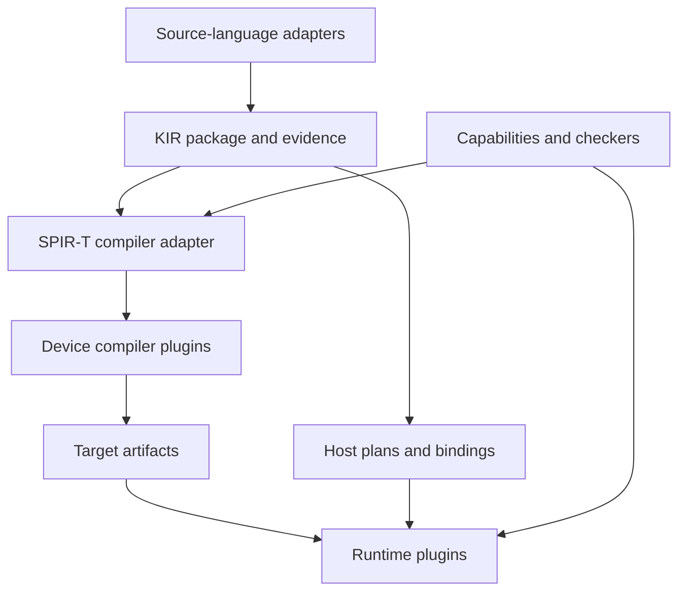

# Build a core that has no vendor or frontend dependency

**Milestone M05.** Independently buildable contract/core packages, generic routing and a deterministic pass planner.

## Required inputs and specification

Start from [M03](../00-current-state-and-gaps/01-freeze-the-semantic-inventory.md), [M04](../00-current-state-and-gaps/02-classify-the-proof-boundary.md). Use the exit-gate dependencies in [the implementation plan](../milestones.json); proof and investigation work may begin earlier. Read [the declarative specification](../Specification/README.md) before choosing representation details. This milestone implements `Extension.decoupled_addition`, `Extension.composable`.

## Separate the four extension axes

1. **Frontend:** understand a source language, discharge or record its verification obligations, and export KIR.
2. **Device compiler:** transform KIR kernel bodies through SPIR-T and lower them to a supported device format.
3. **Device runtime:** allocate resources, load artifacts, submit work, enforce ordering, and report completion/errors.
4. **Host binding:** expose compiled packages and host plans to an application language.

A fifth package type carries **semantic extensions**: operation definitions, capability schemas, reference semantics, checkers, and lowering rules. It does not gain permission to call an unsupported operation safe.

This is a dependency diagram. The host execution plan retains CPU control flow and resource operations; it is not converted into a GPU shader.
## Proposed module ownership

| Component | Owns | May depend on | Must not depend on |
|---|---|---|---|
| `contracts/` | Versioned KIR, artifact, runtime protocol, diagnostics, extension envelope | Serialization specifications | F* AST, Rust object layout, CUDA/Vulkan headers |
| `semantics/` | Operation meanings, memory/effect model, profile obligations | Contracts and proof foundations | Vendor dispatch logic |
| `core/` | Package validation, planning, discovery, deterministic selection, cache policy | Contracts and protocol clients | Concrete GPU SDKs or frontend implementation types |
| `adapters/fstar/` | F*/Pulse extraction and source evidence | Pinned F* internals, contracts | Runtime implementation, Vulkan/CUDA source generation |
| `compiler/spirt/` | KIR ↔ SPIR-T mapping and approved transformation pipelines | Pinned SPIR-T, contracts | Application language runtime |
| Backend package | Code generation, driver adapter, target profile, qualification data | Public contracts; private vendor tooling | Core source patches or other backend internals |
| Host binding package | Idiomatic application API, ownership wrapper, marshaling | Stable runtime protocol/ABI | SPIR-T Rust structs, F* compiler |
| `validation/` | Independent interpreters/checkers, workload tests, evidence inspection | Public contracts | Hidden knowledge of a particular registered backend |

These paths describe responsibilities. P1 decides exact crate/build boundaries. Independently distributed plugins must not require inclusion in the main repository's Cargo workspace or edits to its lockfile. Their lockfiles and native dependencies belong to their own packages.

Prefer safe Rust for the new core, contract tools, and SPIR-T adapter. Keep necessary native driver FFI in small auditable runtime adapters or helper processes. This is a containment policy, not a claim that all driver interactions can be implemented without unsafe code. Retain the existing F* implementation of the frontend adapter initially.

## Create the shared components once

| Proposed component | Public input/output | Internal responsibility | Forbidden dependency |
|---|---|---|---|
| `contracts` | Versioned byte schemas and semantic identifiers | Canonical encoding, size limits, compatibility rules | GPU SDKs, F* AST, SPIR-T object layouts |
| `semantics` | Operation definitions and proof/checker contracts | KIR/host state meaning and refinement relations | Vendor dispatch or device discovery |
| `core` | Packages, policy, requests, responses | Admission, planning, cache identity, generic role routing | Named backend implementations or their build dependencies |
| `frontend-fstar` | Pinned checked source → KIR/evidence | Typed capture, specialization, erasure correspondence | Vulkan objects or CUDA source text in public artifacts |
| `compiler-spirt-sdk` | Private worker API | Construct SPIR-T, manage approved passes, emit target formats | Stable process ABI commitments about Rust internals |
| Compiler package | Compiler protocol → target package | Backend-specific lowering/toolchain and provenance | Patching the installed core or another backend |
| Runtime package | Runtime protocol → execution results | Device resources, queues, visibility, driver errors | Source language or compiler heap objects |
| Binding package | Language API → common host/runtime contract | Ownership wrappers and checked marshaling | Backend-specific kernel recompilation |
| Checker package | Evidence request → checked result | One recognized relation/proof format | Self-authorizing trust or changing old semantic IDs |

Implement `core` against protocol clients and opaque artifact identities. Keep concrete backend crates out of its Cargo dependency graph. Backend packages have their own build roots, lockfiles, native dependencies, and release artifacts. Installing a backend must not amend the root workspace, feature list, link flags, or workflow vendor matrix.

SPIR-T workers may privately use different pinned SPIR-T revisions. Their public input remains KIR and their public output remains a versioned artifact package. Shared SDK reuse is an implementation choice within the package. The official [SPIR-T Module API](https://rust-gpu.github.io/spirt/spirt/struct.Module.html) exposes context-owned entities and a non-thread-safe context; it does not define this plugin ABI. Isolate that implementation behind the worker.

## Define composition using data

Resolve a route as `(frontend contract, KIR profile, compiler service, artifact format/ABI, runtime service, host binding, evidence policy)`. Each edge has a schema/version and semantic requirements. Match declared constraints with checked actual artifact requirements and device capabilities. Reject missing or conflicting edges before execution.

Use namespaced identifiers and content digests for roles, formats, operations, and checkers. The core knows the role protocols and extension envelope, not an enum of GPU vendors. A compiler may produce several formats, and a runtime may consume several compatible formats. A package may implement multiple roles, but its roles remain separately addressable and substitutable.

No routing rule may inspect source-language syntax, CUDA symbol names, or backend package names to determine semantics. Unknown required fields/operations fail closed. The core may copy opaque vendor payloads after validating their declared envelope; only the designated worker/runtime interprets their private meaning.

## Preserve information across representations

Keep kernel semantics, host plans, layout, requirements, and evidence in the portable package. Keep SPIR-T entity handles, analysis caches, native pointers, and driver handles process-local. Target packages contain device bytes plus reflection, requirements, specialization and evidence identities.

A pass result records its input/output digests and established/preserved/invalidated facts. Rewrites must map one-to-many or many-to-one operations explicitly where evidence depends on that correspondence. Debug-only source spans may be dropped; semantic preconditions, effects, and numeric policies cannot disappear with them.

## Implement the planner

Separate mandatory legalization from optional optimization. Select only passes whose input dialect, side-effect model, required analyses, capability constraints, and evidence policy are satisfied. Build a deterministic DAG of scheduled pass instances. A fixed-point pass is a bounded composite with a termination budget and declared evidence relation; do not encode an unbounded cycle in the planner.

Store the selected plan before compilation and include it in cache identity. On pass failure, discard partial success outputs. A fallback may change implementation but must satisfy the same semantics and evidence policy. Requests to weaken those policies are new explicit requests, not retries of the original one.

## Verify decoupling continuously

Inspect dependency graphs and dynamic loads. Run an installed core with a read-only source checkout and no vendor SDK present. Discovery, inspection, and unsupported-target diagnostics must work. Add a backend package externally and prove only the new package/configuration/cache changed. Use the [complete substitution matrix](../03-backend-extension-contract/03-prove-additive-installation.md) before v1 freeze and for the final release candidate.

## Evidence required to close this milestone

Close **G-CONTRACT** only with the implementation artifacts, positive and negative cases, and source-to-result identities required above. Link the implementation relation to the named F* symbols and the policy's applicable O1–O10 obligations. The specification's proved lemmas are reusable model facts; they do not discharge this implementation correspondence. Record unresolved cases as blockers or explicitly outside the claim. No backend gate is marked passed by this roadmap revision.
