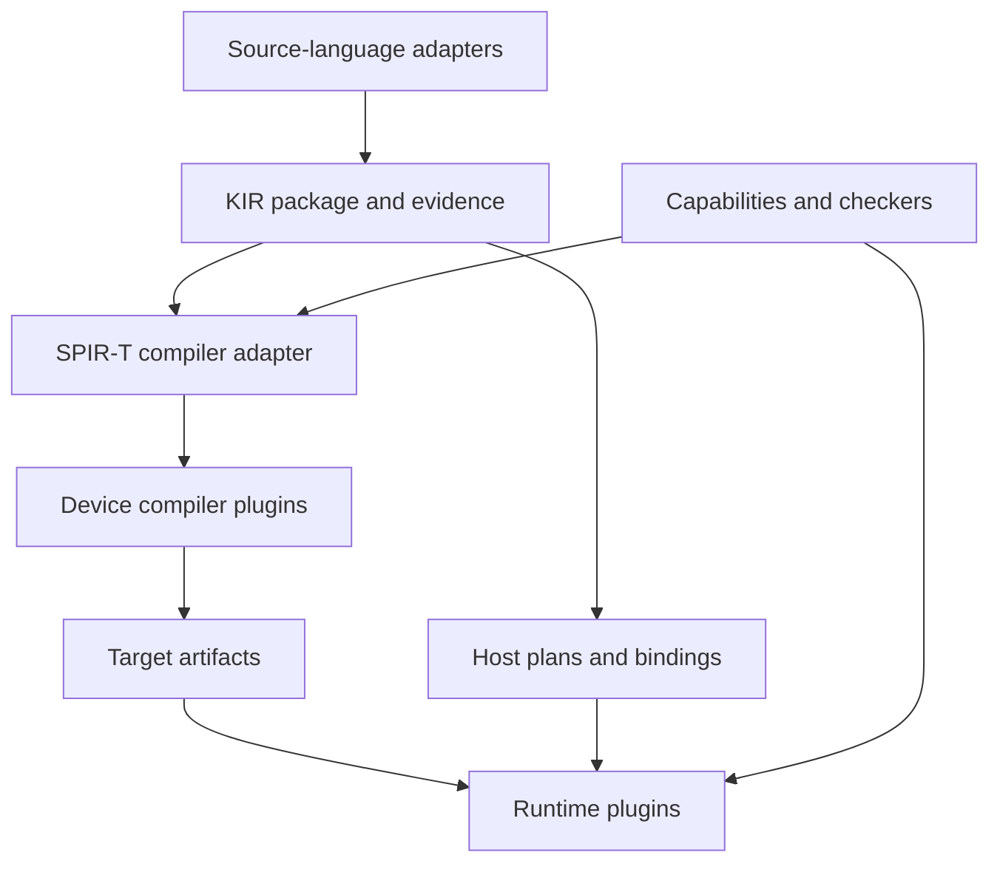

# Boundaries

## 1. Separate the four extension axes

1. **Frontend:** understand a source language, discharge or record its verification obligations, and export KIR.
2. **Device compiler:** transform KIR kernel bodies through SPIR-T and lower them to a supported device format.
3. **Device runtime:** allocate resources, load artifacts, submit work, enforce ordering, and report completion/errors.
4. **Host binding:** expose compiled packages and host plans to an application language.

A fifth package type carries **semantic extensions**: operation definitions, capability schemas, reference semantics, checkers, and lowering rules. It does not gain permission to call an unsupported operation safe.

This is a dependency diagram. The host execution plan retains CPU control flow and resource operations; it is not converted into a GPU shader.
## 2. Proposed module ownership

| Component | Owns | May depend on | Must not depend on |
|---|---|---|---|
| `contracts/` | Versioned KIR, artifact, runtime protocol, diagnostics, extension envelope | Serialization specifications | F* AST, Rust object layout, CUDA/Vulkan headers |
| `semantics/` | Operation meanings, memory/effect model, profile obligations | Contracts and proof foundations | Vendor dispatch logic |
| `core/` | Package validation, planning, discovery, deterministic selection, cache policy | Contracts and protocol clients | Concrete GPU SDKs or frontend implementation types |
| `adapters/fstar/` | F*/Pulse extraction and source evidence | Pinned F* internals, contracts | Runtime implementation, Vulkan/CUDA source generation |
| `compiler/spirt/` | KIR ↔ SPIR-T mapping and approved transformation pipelines | Pinned SPIR-T, contracts | Application language runtime |
| Backend package | Code generation, driver adapter, target profile, qualification data | Public contracts; private vendor tooling | Core source patches or other backend internals |
| Host binding package | Idiomatic application API, ownership wrapper, marshaling | Stable runtime protocol/ABI | SPIR-T Rust structs, F* compiler |
| `validation/` | Independent interpreters/checkers, workload tests, evidence inspection | Public contracts | Hidden knowledge of a particular registered backend |

These paths describe responsibilities. P1 decides exact crate/build boundaries. Independently distributed plugins must not require inclusion in the main repository's Cargo workspace or edits to its lockfile. Their lockfiles and native dependencies belong to their own packages.

Prefer safe Rust for the new core, contract tools, and SPIR-T adapter. Keep necessary native driver FFI in small auditable runtime adapters or helper processes. This is a containment policy, not a claim that all driver interactions can be implemented without unsafe code. Retain the existing F* implementation of the frontend adapter initially.
