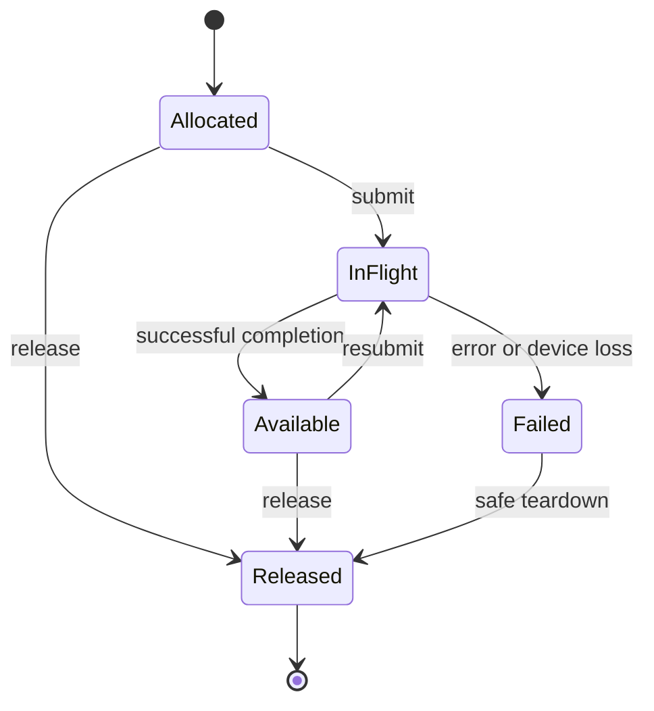

# 05. Runtime, host interoperability, and operations

## 1. Model execution before binding an API

Define device, context, allocation, buffer view, module, pipeline, queue, submission, event, and imported-resource identities. Handles are opaque, generation-checked, and scoped to the runtime/device that owns them. A stale handle or a handle from another device must be rejected.

For every operation, specify preconditions, success effects, recoverable failure effects, and device-loss effects. An allocation failure cannot consume a resource that was never created. A partially submitted graph cannot be reported as though no work ran. Failure results must identify what is known to have completed.

Use an explicit resource state machine:

This diagram abstracts multiple concurrent readers and subranges. The actual model must track those permissions and dependencies, not force all resources through a single exclusive state. A timeout does not establish completion or make an in-flight allocation safe to reuse.

## 2. Preserve stream/epoch semantics

Kuiper currently uses queue positions and pledges so dependent launches can chain without returning ownership to the host. [Q8](10-sources.md) Preserve that relation in the runtime API:

1. A queue owns a unique monotonic submission sequence within its lifetime/generation.
2. A returned submission/event token denotes the exact operation and dependencies accepted by the runtime.
3. Queue order must be accompanied by the memory dependencies needed for reads to observe prior writes.
4. Host ownership may be recovered only after successful completion and the required host visibility operations.
5. Cross-queue use requires an explicit dependency/ownership transfer; sharing the same numeric epoch is meaningless across queues.
6. Failed submissions and device loss do not mint normal successful postconditions.

For Vulkan, map the relation to command buffers, pipeline barriers, semaphores/fences or timeline semaphores where supported, queue family transfers when needed, and host flush/invalidate operations for noncoherent memory. Choose stages/access masks from the real producer/consumer effects. [E1–E2](10-sources.md)

Copy the *required observable order* of the current CUDA path. Do not reproduce CUDA NULL-stream assumptions by name or assume queue order alone supplies visibility. If the new API changes whether a copy is synchronous, provide an explicit wrapper or source-level contract change.

## 3. Resource safety

- Record allocation extent, alignment, memory kind, device, generation, and outstanding uses.
- Check slice arithmetic and byte-size multiplication for overflow before calling the driver.
- Keep pinned/borrowed host buffers alive until all asynchronous uses finish; document whether the runtime copies or borrows host input.
- Define aliasing permissions across views and across bindings. A safe Rust wrapper cannot infer uniqueness merely from an opaque C handle.
- Validate launch arguments against reflection and the artifact ABI, including offsets, lengths, strides, scalar encodings, and specialization values.
- Defer freeing resources still in use or reject the operation predictably; specify the policy and its memory costs.
- Define callbacks, thread affinity, thread safety, reentrancy, process teardown, and runtime shutdown. Never call application code while holding an undocumented global runtime lock.
- Preserve explicit device selection. An allocation must not silently move to a fallback device with different capability or visibility assumptions.

The baseline uses logical buffers. Unified virtual addressing, sparse allocations, device-address pointers, peer copies, external memory, and RDMA are separate capability profiles; their coherence and lifetime guarantees require their own evidence.

## 4. Host ABI and bindings

The C-compatible ABI exposes opaque handles, fixed-width values, explicit lengths, versioned descriptors, and status/error retrieval. Specify who allocates/frees every returned object and the lifetime of error strings. Avoid C `long`, platform-dependent enums, implicit struct padding, and unspecified allocator sharing.

Generate bindings from the same contract wherever practical. C and Rust bindings must load identical device packages and exercise the same host plans. The Rust binding should expose safe ownership wrappers over a small reviewed unsafe boundary. Other languages can use IPC, C FFI, or a native implementation of the protocol.

Include asynchronous APIs with explicit completion objects, cancellation semantics, and error propagation. Cancellation can prevent future submission or stop waiting; it must not falsely promise arbitrary already-submitted GPU work has stopped. Provide bounded batching to control IPC overhead.

The host-plan interpreter supplies a portable implementation. Optional native host code generation is another plugin role. It must preserve the same operation order, effects, and failure cleanup. A generated C header is one binding, not the canonical program representation.

## 5. External interoperability

Start with standalone buffers and explicit host transfers. Add external memory and synchronization only when a real integration needs them. Each import/export contract states resource ownership, device compatibility, allowed handle types, mapping restrictions, synchronization handoff, and destruction rules.

Tensor-framework interoperability should preserve shape, stride, element type, device identity, and producer/consumer synchronization. A zero-copy claim requires measurements and an actual shared allocation; it is not established by avoiding a copy in one wrapper.

CUDA interoperability may exist in an optional compatibility package. It must not introduce a CUDA dependency into ordinary Vulkan or Metal use. GPUDirect/RDMA, GPU-initiated I/O, or a GPU-native operating system are independent projects, not consequences of changing the compiler IR.

## 6. Compilation, cache, and package lifecycle

Cache keys include normalized KIR, evidence policy, contract and semantic digests, backend/compiler versions, pass sequence, target/device features, numeric policy, specialization, ABI layouts, and relevant driver compatibility identity. Driver-native caches need stricter device/driver compatibility than portable SPIR-V.

Use bounded cache storage, atomic writes, corruption checks, and concurrent-reader/writer handling. Never reuse evidence after a source, operation definition, numeric flag, or backend lowering changes. Distinguish reproducibility of frontend artifacts from implementation-dependent driver pipeline caches.

Ship the portable package separately from the compiler and runtime packages. Applications that only load precompiled target packages should not need F*, SPIR-T, Rust tooling, OCaml, Karamel, or a shader compiler installed at runtime unless a selected backend explicitly requires compilation there.

Provide clean offline installation from pinned artifacts, dependency/license inventory, diagnostic inspection without a GPU, and uninstall/rollback without modifying unrelated packages.

## 7. Failure and operational tests

Inject allocation exhaustion, pipeline compile errors, malformed packages, unsupported features, queue submission errors, worker crashes, host cancellation, timeouts, device loss, corrupted cache entries, and shutdown during in-flight work. Some device-loss behavior needs dedicated hardware or a controlled harness; report simulated and observed evidence separately.

Expose structured stage timings, cache hits, chosen device/profile, fallback reasons, queue waits, memory use, and driver error details. Do not log full proprietary kernels or input buffers by default. Debug bundles should be opt-in and include enough hashes/configuration to reproduce failures without unnecessary application data.

For a service deployment, validate input/package sizes and resource budgets before expensive compilation or allocation. Trust boundaries must include native plugins, compiler workers, driver/kernel interfaces, and application callbacks. Memory-safe core code does not make arbitrary device execution safe by itself.
