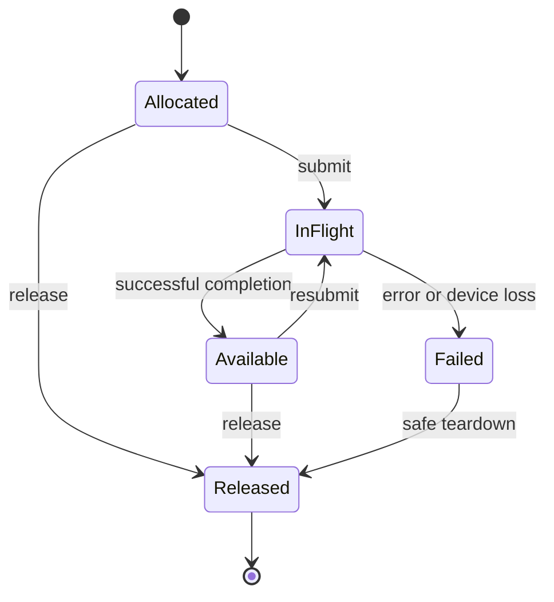

# Enforce submission, dependency failure and bounded retirement

**Milestone M17.** A bounded session protocol that gates consumers on success, reconciles uncertain acceptance and redeems ownership once.

## Required inputs and specification

Start from [M09](../02-language-independent-extraction/03-run-host-plans-from-two-languages.md), [M11](../03-backend-extension-contract/02-match-artifacts-to-independent-runtimes.md). Use the exit-gate dependencies in [the implementation plan](../milestones.json); proof and investigation work may begin earlier. Read [the declarative specification](../Specification/README.md) before choosing representation details. This milestone implements `Runtime.safe_step`, `Runtime.runnable`, `Runtime.may_retire`.

## Model execution before binding an API

Define device, context, allocation, buffer view, module, pipeline, queue, submission, event, and imported-resource identities. Handles are opaque, generation-checked, and scoped to the runtime/device that owns them. A stale handle or a handle from another device must be rejected.

For every operation, specify preconditions, success effects, recoverable failure effects, and device-loss effects. An allocation failure cannot consume a resource that was never created. A partially submitted graph cannot be reported as though no work ran. Failure results must identify what is known to have completed.

Use an explicit resource state machine:

This diagram abstracts multiple concurrent readers and subranges. The actual model must track those permissions and dependencies, not force all resources through a single exclusive state. A timeout does not establish completion or make an in-flight allocation safe to reuse.
## Preserve stream/epoch semantics

Kuiper currently uses queue positions and pledges so dependent launches can chain without returning ownership to the host. [Q8](../10-sources/README.md) Preserve that relation in the runtime API:

1. A queue owns a unique monotonic submission sequence within its lifetime/generation.
2. A returned submission/event token denotes the exact operation and dependencies accepted by the runtime.
3. Queue order must be accompanied by the memory dependencies needed for reads to observe prior writes.
4. Host ownership may be recovered only after successful completion and the required host visibility operations.
5. Cross-queue use requires an explicit dependency/ownership transfer; sharing the same numeric epoch is meaningless across queues.
6. Failed submissions and device loss do not mint normal successful postconditions.

For Vulkan, map the relation to command buffers, pipeline barriers, semaphores/fences or timeline semaphores where supported, queue family transfers when needed, and host flush/invalidate operations for noncoherent memory. Choose stages/access masks from the real producer/consumer effects. [E1–E2](../10-sources/README.md)

Copy the *required observable order* of the current CUDA path. Do not reproduce CUDA NULL-stream assumptions by name or assume queue order alone supplies visibility. If the new API changes whether a copy is synchronous, provide an explicit wrapper or source-level contract change.

## Specify acceptance before implementing transport retries

Runtime identity is `(admitted package instance, device/context, session generation)`. Operation identity adds a monotonically allocated request/submission ID. Reject handles from another instance or generation. Never retry a submission as new work merely because an IPC reply was lost.

Within a live session, keep an operation table with request digest, reserved resource permissions, acceptance state, driver submission/event identity, and completion/failure state. Repeating the same ID and digest returns/query-reconciles the existing operation. The same ID with different contents is a protocol error. Define the acceptance point before returning an accepted token; reserve resources before work can race with a caller's release.

| State | Permitted transition | Resource meaning |
|---|---|---|
| Received/unaccepted | Validate → rejected or accepted | Caller retains ownership until specified transfer; no driver submission before acceptance bookkeeping |
| Rejected | Terminal with rejection reason | No work accepted; specified caller ownership retained |
| Accepted | Submit → in-flight or reported accepted failure | Runtime retains reserved resources and owes an outcome |
| In-flight | Completion, session/device failure, or unknown client observation | No premature host reuse or successful postcondition |
| CompletedUnchecked | Visibility and guard/postcondition checks → succeeded or failed | Completion alone grants no successful postcondition |
| Succeeded | Reconcile and redeem once | Recover the specified ownership and established postcondition |
| Failed/poisoned | Safe destruction/reinitialization under the failure relation | No successful kernel postcondition; contents may be invalid |
| Client observation unknown | Query live session or fail session under policy | No blind replay, no inferred rejection or completion |

The first IPC profile need not recover across worker process death. It may fail the session, quarantine affected resources until backend teardown establishes safe disposition, then require a fresh generation. Advertise that limitation. Persistent exactly-once recovery is a later capability requiring its own durable state/reconciliation design. Never infer GPU completion from worker death alone, especially for imported resources.

## Preserve epochs and visibility

Use unique monotonically ordered submission tokens within each queue generation. Dependencies reference exact tokens, not equal integers from unrelated queues. Queue order must be refined to the target's execution and memory dependencies. Return a normal completion witness only after backend completion and required host visibility steps.

Partial graph acceptance returns the accepted prefix/set and its obligations. If the result is unknown, retain the complete potentially affected resource set until reconciliation/failure policy resolves it. Cancellation can reject unaccepted work or stop waiting; it does not promise to stop arbitrary submitted GPU work.

Inject failures before acceptance, after acceptance, after driver submission, and after completion but before reply delivery. Use a counter-increment kernel and dependent launches to expose duplicate execution and false ownership recovery. Test event/counter wraparound as a generation change rather than silently reusing identities.

## Pin active objects to package instances

All resources, pipelines, callbacks, events, dispatch tables and destructors retain the exact admitted package instance. Disable means reject new sessions; it does not unload active code. An upgrade installs a new instance alongside the old one. Existing handles continue to route only to their original instance.

Use reference-counted/otherwise proved ownership of the provider lifetime. Drain or fail old sessions under the defined policy, destroy resources/callback registrations in dependency order, then unload. Keep private libraries and worker executables available until the last permitted owner releases them. Refuse live replacement if that policy cannot be met.

Rollback selects the earlier qualified package for new sessions, invalidates only incompatible cache/evidence identities, and preserves or safely closes existing sessions. Test disable/upgrade/rollback during a kernel, mapping, event wait and callback, including failure to drain. A raw library unload while function pointers remain live is prohibited.

## Define the failure boundary of each transport

IPC compiler/runtime services can isolate process aborts, subject to resource/session failure rules. In-process runtimes expose a documented application-fatal boundary for aborting panics, native crashes or violated provider invariants. Catch recoverable language exceptions before crossing the ABI; do not promise universal recovery through `catch_unwind`. The official [Rust documentation](https://doc.rust-lang.org/std/panic/fn.catch_unwind.html) distinguishes unwinding from aborting panics.

For every operation document resources created, consumed, retained, released or poisoned on each outcome. Test returned errors and caught unwinds, and run abort cases in a controlled subprocess. No error path may mint a successful source postcondition.

## Gate every consumer on successful producer evidence

Implement V2-01 by distinguishing `CompletedUnchecked` from `Succeeded`. The first runtime schedules a consumer only after every required producer has completed, its guard result is visible and successful, and the producer's postcondition is justified. A device fence or timeline value alone cannot establish that result. Keep the consumer unsubmitted while any predecessor is unresolved. Reserve its inputs without granting access to poisoned output.

On a producer failure, mark all dependent unsubmitted operations as dependency-failed and propagate that state through joins and cross-queue edges. Independent branches may continue. A graph's accepted set identifies obligations, not an unconditional right to submit every node. Retain all resources touched by already submitted work until that work is quiescent or a justified teardown resolves it. Return partial-acceptance and failure information without minting successful evidence. Report which producer caused a transitive failure.

A later device-side chain is a new qualified lowering. It must make guard status visible across the relevant scope, suppress every invalid consumer effect, preserve collective participation, propagate join failure, and implement the same observable failure relation. Reject it until O6/O8 evidence exists. Do not pre-submit a normal consumer and plan to report its producer's failure afterward.

Use `Runtime.runnable`, `deps_succeeded`, `publishable`, `safe_step` and `failed_dependency_blocks` from the declarative specification. Inject A's failure before B uses A's output as an index; B must never dispatch on the initial host-gated path. Repeat with a diamond join, unrelated branch, different queue, lost reply, partial acceptance and a consumer containing a barrier.

## Bound operation history without allowing replay

Implement V2-03 with a negotiated window W (initial default 64), a session generation and a contiguous retired watermark R. Accept a new ID only in `(R, R+W]` when its slot is absent. IDs arrive out of order: an absent ID inside the window is new, while any ID at or below R is permanently retired. Never infer retirement from the largest ID observed. The client issues IDs monotonically without reuse; overflow fails/drains the session before allocating a fresh generation.

Inside the window, keep the original canonical request, digest, acceptance state, resources, driver identity, outcome and redemption state. Equal-ID/equal-request repetition observes the existing operation; unequal content is a protocol violation. Query returns status only. Recover ownership through an atomic, idempotent redemption operation bound to the original owner identity; repeated redemption observes its recorded outcome and does not issue a second linear capability.

The client acknowledges a contiguous prefix only after each slot has a terminal outcome and its ownership outcome has been reconciled. The server retires that prefix only after no live dependent needs its success fact, or after moving that fact into a separately bounded dependency record. The baseline retains the prefix until such dependents finish. An unresolved hole or forgotten handle applies backpressure; it cannot cause silent eviction. A skipped ID must have an explicit rejected/closed slot before the watermark crosses it. Bound diagnostics and completed-result payloads as well as slot count.

Use `Runtime.fresh`, `may_retire`, `retired_never_fresh` and `redeemed_once`. Exercise out-of-order delivery, duplicate replies, retirement boundaries, a stalled first slot, live dependents, two clients attempting redemption, memory pressure and generation rollover. Durable recovery across worker death remains unsupported in the initial profile; fail the session without replaying uncertain GPU work.

## Evidence required to close this milestone

Close **G-CONCURRENCY, O8** only with the implementation artifacts, positive and negative cases, and source-to-result identities required above. Link the implementation relation to the named F* symbols and the policy's applicable O1–O10 obligations. The specification's proved lemmas are reusable model facts; they do not discharge this implementation correspondence. Record unresolved cases as blockers or explicitly outside the claim. No backend gate is marked passed by this roadmap revision.
