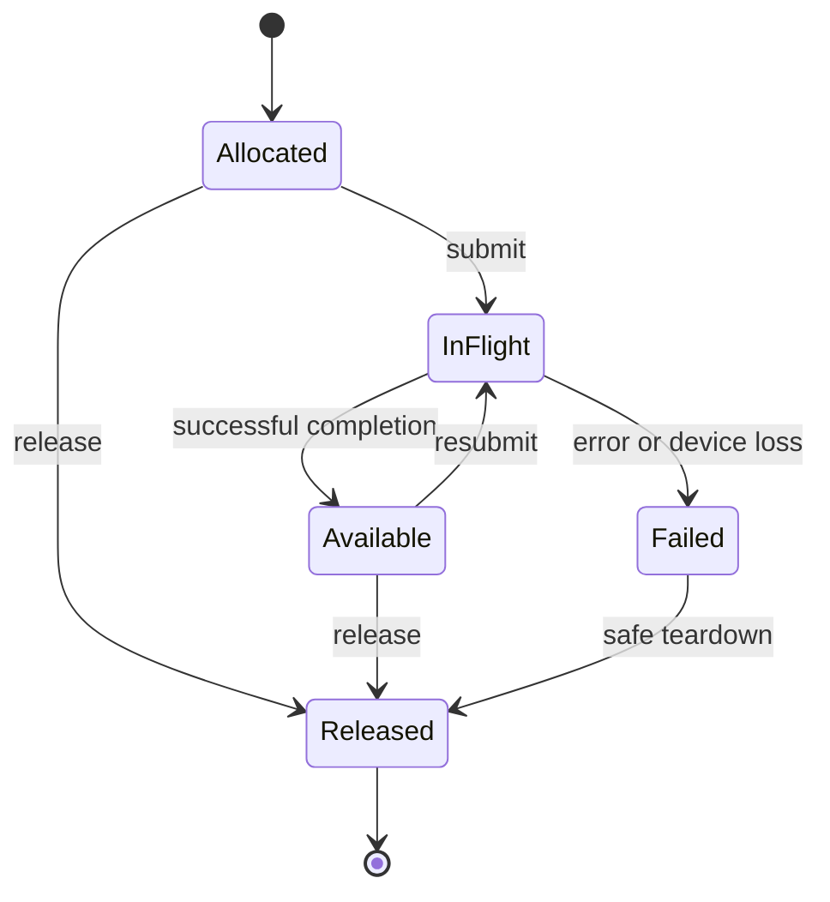

# State and epochs

## 1. Model execution before binding an API

Define device, context, allocation, buffer view, module, pipeline, queue, submission, event, and imported-resource identities. Handles are opaque, generation-checked, and scoped to the runtime/device that owns them. A stale handle or a handle from another device must be rejected.

For every operation, specify preconditions, success effects, recoverable failure effects, and device-loss effects. An allocation failure cannot consume a resource that was never created. A partially submitted graph cannot be reported as though no work ran. Failure results must identify what is known to have completed.

Use an explicit resource state machine:

This diagram abstracts multiple concurrent readers and subranges. The actual model must track those permissions and dependencies, not force all resources through a single exclusive state. A timeout does not establish completion or make an in-flight allocation safe to reuse.
## 2. Preserve stream/epoch semantics

Kuiper currently uses queue positions and pledges so dependent launches can chain without returning ownership to the host. [Q8](../10-sources/README.md) Preserve that relation in the runtime API:

1. A queue owns a unique monotonic submission sequence within its lifetime/generation.
2. A returned submission/event token denotes the exact operation and dependencies accepted by the runtime.
3. Queue order must be accompanied by the memory dependencies needed for reads to observe prior writes.
4. Host ownership may be recovered only after successful completion and the required host visibility operations.
5. Cross-queue use requires an explicit dependency/ownership transfer; sharing the same numeric epoch is meaningless across queues.
6. Failed submissions and device loss do not mint normal successful postconditions.

For Vulkan, map the relation to command buffers, pipeline barriers, semaphores/fences or timeline semaphores where supported, queue family transfers when needed, and host flush/invalidate operations for noncoherent memory. Choose stages/access masks from the real producer/consumer effects. [E1–E2](../10-sources/README.md)

Copy the *required observable order* of the current CUDA path. Do not reproduce CUDA NULL-stream assumptions by name or assume queue order alone supplies visibility. If the new API changes whether a copy is synchronous, provide an explicit wrapper or source-level contract change.
